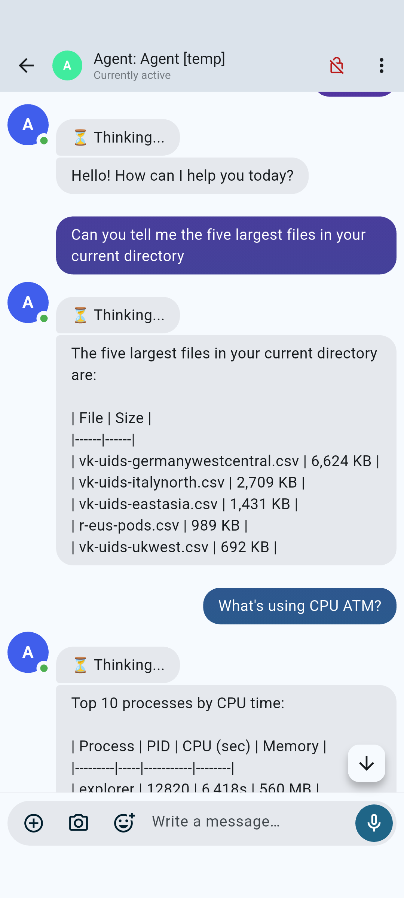

<p align="center">
  
  &nbsp;&nbsp;&nbsp;&nbsp;
  
</p>

# Agent Synapse Proxy

Chat with [GitHub Copilot](https://github.com/features/copilot) coding agents from your phone.

Uses a self-hosted [Matrix](https://matrix.org) server as a secure bridge between a mobile chat app ([FluffyChat](https://fluffychat.im)) and the Copilot CLI SDK running on your development machine.

```
Phone (FluffyChat)            Developer Machine
       │                             │
       └──── Matrix Server ──────────┘
              (Synapse)         agent_proxy.py
                                     │
                                Copilot SDK
                                     │
                                Copilot CLI
```

Each working directory gets its own Matrix room. Send a message from your phone → the bot forwards it to Copilot → response appears in the chat.

<p align="center">
  
</p>

## Quickstart (~10 minutes)

### Prerequisites

| What | Where |
|------|-------|
| **Docker + Docker Compose** | On the machine that will host Matrix (Linux server, VPS, etc.) |
| **A domain name** | Pointed at your server (e.g. `matrix.example.com`). Ports 80 + 443 open. |
| **Python 3.12+** | On your dev machine (Windows or Linux) |
| **GitHub Copilot CLI** | `npm install -g @github/copilot` or equivalent |
| **FluffyChat** | [Android](https://play.google.com/store/apps/details?id=chat.fluffy.fluffychat) / [iOS](https://apps.apple.com/app/fluffychat/id1551469600) |


### Step 1 — Deploy Matrix Server

Assuming your domain is setup, SSH into your server and run:

```bash
git clone https://github.com/YOUR_USER/agent-synapse-proxy.git
cd agent-synapse-proxy/server

# Set your domain and deploy
export MATRIX_DOMAIN="matrix.example.com"
# this will use docker compose to standup a secure Matrix endpoint
bash setup.sh
```

This starts Postgres + Synapse + Caddy (auto-TLS) and prompts you to create an admin password.

> **Output:** `https://matrix.example.com` serving the Matrix client API with Let's Encrypt TLS.


### Step 2 — Register Bot User(s)

In order to keep the server's attack surface small we don't expose the API endpoint. This why you must, from your Matrix server run this:

```bash
cd /opt/matrix   # or wherever setup.sh deployed to
bash register-bot.sh bot-laptop my-secret-password
```

Create one bot user per machine that will run agents. Names like `bot-laptop`, `bot-desktop`, `bot-ci` work well.


### Step 3 — Install Agent on Dev Machine

**Windows (PowerShell):**
```powershell
# Set credentials (or the installer will prompt)
$env:MATRIX_HOMESERVER   = "https://matrix.example.com"
$env:MATRIX_ADMIN_USER   = "@admin:matrix.example.com"
$env:MATRIX_BOT_USERNAME = "bot-laptop"
$env:MATRIX_BOT_PASSWORD = "my-secret-password"

# Run installer
.\scripts\install.ps1
```

**Linux / WSL:**
```bash
export MATRIX_HOMESERVER="https://matrix.example.com"
export MATRIX_ADMIN_USER="@admin:matrix.example.com"
export MATRIX_BOT_USERNAME="bot-laptop"
export MATRIX_BOT_PASSWORD="my-secret-password"

bash scripts/install.sh
```

This creates `~/.agent-synapse-proxy/` with a Python venv, bot code, credentials, and a `start-agent` command on your PATH.


### Step 4 — Connect Your Phone

1. Open **FluffyChat** → *Connect to homeserver*
2. Enter `https://matrix.example.com`
3. Login as `admin` with the password you chose in Step 1
4. Accept room invites as they appear

### Step 5 — Run an Agent

```bash
cd ~/my-project
start-agent
```

A room called **"Agent [my-project]"** appears in FluffyChat. Send a message — Copilot replies.

```bash
# Different directory = different room, same bot user
cd ~/other-project
start-agent
```

Override the model:
```bash
start-agent --model gpt-5          # Linux
start-agent -Model gpt-5           # Windows
```

## How It Works

1. `start-agent` launches `agent_proxy.py` with the current directory as context
2. The bot logs into Matrix as your pre-registered bot user
3. It finds or creates a room named `Agent [<directory>]` and invites your admin user
4. Messages you send from FluffyChat are forwarded to the Copilot SDK
5. Copilot responses are posted back to the room
6. Session IDs are saved so restarting `start-agent` in the same directory resumes the conversation

## Environment Variables

| Variable | Default | Description |
|----------|---------|-------------|
| `MATRIX_HOMESERVER` | `http://localhost:8008` | Synapse URL |
| `MATRIX_ADMIN_USER` | `@admin:localhost` | Your Matrix user ID |
| `MATRIX_BOT_USERNAME` | hostname-based | Pre-registered bot username |
| `MATRIX_BOT_PASSWORD` | *(required)* | Bot password |
| `COPILOT_MODEL` | `claude-sonnet-4` | Copilot model |
| `AGENT_WORK_DIR` | current directory | Override working directory |
| `COPILOT_CLI_URL` | *(auto)* | Connect to external Copilot CLI server |

## Project Structure

```
agent-synapse-proxy/
  bot/                    Python bot source
    agent_proxy.py          Matrix ↔ Copilot bridge
    config.py               Configuration from env vars
    terminal_client.py      Optional terminal Matrix client
    requirements.txt        Python dependencies
  server/                 Matrix server deployment
    docker-compose.yml      Postgres + Synapse + Caddy
    Caddyfile               TLS + reverse proxy config
    setup.sh                Automated server setup
    register-bot.sh         Register bot users (LAN only)
  scripts/                Agent machine installers
    install.ps1             Windows installer
    install.sh              Linux/WSL installer
    start-agent.ps1         Windows launcher
    start-agent.sh          Linux/WSL launcher
  hooks/                  Optional Copilot CLI monitoring hooks
```

## Security

- **Self-hosted**: Your messages never leave your infrastructure
- **TLS**: Caddy auto-provisions Let's Encrypt certificates
- **No open registration**: Users can only be created via admin API from LAN/localhost
- **Admin API blocked**: Caddy returns 403 for `/_synapse/admin/*` from the internet
- **Federation disabled**: Your server doesn't talk to other Matrix servers
- **Message filtering**: Only messages from `MATRIX_ADMIN_USER` are processed
- **Rate limited**: Login and message rate limits enabled by default

## Troubleshooting

| Problem | Solution |
|---------|----------|
| `Login failed` | Is the bot user registered? Run `register-bot.sh` from the server. |
| `Connection refused` | Check that Synapse is running: `docker compose ps` on the server. |
| `Certificate error` | Ensure ports 80+443 are forwarded and DNS points to your server. |
| `aiohttp build fails` (Windows ARM) | Set `$env:AIOHTTP_NO_EXTENSIONS=1` before install. The installer does this automatically. |
| FluffyChat can't connect | Use `https://` URL. FluffyChat requires valid TLS for non-localhost servers. |
| Room not appearing | Check FluffyChat for pending invites. The bot auto-invites your admin user. |


## Limitations

- Github Copilot CLI and the Github Copilot SDK differ slightly in the way they get configured. While this project tries to eliminate these differences there are some (model choices, tooling)
- FluffyChat doesn't seem to render Markdown so formatting will be off on mobile.


## License

MIT
